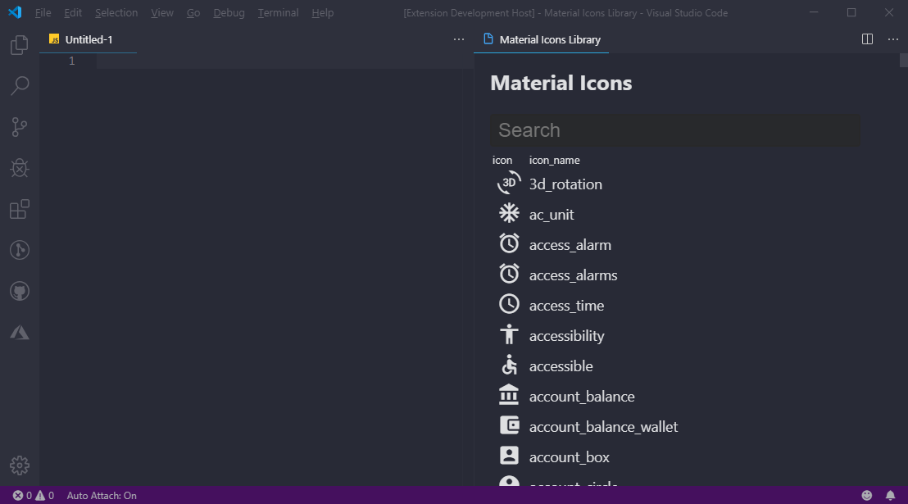
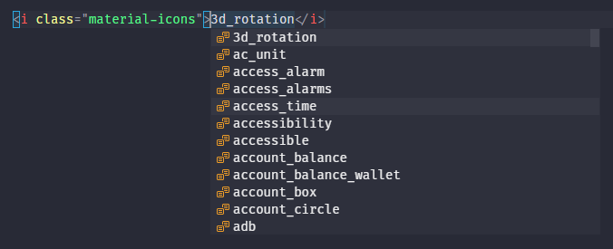

# Quick Material Icons

A VSCode extension that makes it easy to insert material icons from [material.io](https://material.io/resources/icons/).

Get it on the [VSCode Marketplace](https://marketplace.visualstudio.com/items?itemName=Box-Of-Hats.quick-material-icons)

## Material Icon List

Use command `Quick Material Icons: Show Icon List` to open a searchable list of all available material icons.



## Snippets

### Material Icons CDN

```html
<link
    href="https://fonts.googleapis.com/icon?family=Material+Icons"
    rel="stylesheet"
/>
```

### Material Icon

```html
<i class="material-icons">settings</i>
```


